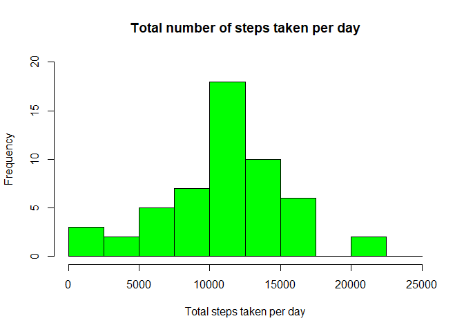

Loading and preprocessing the data
----------------------------------

    activityData <- read.csv("./activity.csv")
    summary(activityData)

    ##      steps                date          interval     
    ##  Min.   :  0.00   2012-10-01:  288   Min.   :   0.0  
    ##  1st Qu.:  0.00   2012-10-02:  288   1st Qu.: 588.8  
    ##  Median :  0.00   2012-10-03:  288   Median :1177.5  
    ##  Mean   : 37.38   2012-10-04:  288   Mean   :1177.5  
    ##  3rd Qu.: 12.00   2012-10-05:  288   3rd Qu.:1766.2  
    ##  Max.   :806.00   2012-10-06:  288   Max.   :2355.0  
    ##  NA's   :2304     (Other)   :15840

What is mean total number of steps taken per day?
-------------------------------------------------

First we calculate the total number of steps taken per day

    totalStepsByDay <- aggregate(steps~date, activityData, sum)

Make histogram of the total number of steps taken each day

    hist(totalStepsByDay$steps, main = "Total number of steps taken per day", xlab = "Total steps taken per day", col = "green", ylim = c(0, 20), breaks = seq(0,25000, by=2500))

Mean of the total number of steps taken per day

    mean(totalStepsByDay$steps)

    ## [1] 10766.19

Median of the total number of steps taken per day

    median(totalStepsByDay$steps)

    ## [1] 10765

What is the average daily activity pattern?
-------------------------------------------

Make a time series plot of the 5-minute interval (x-axis) and the
average number of steps taken, averaged across all days (y-axis)

    averageStepsByInterval <- aggregate(steps~interval, activityData, mean)
    names(averageStepsByInterval) <- c("interval", "mean")
    plot(averageStepsByInterval$interval, averageStepsByInterval$mean, type = "l", col = "green", lwd = 2, xlab = "Interval", ylab = "Average number of steps", main = "Average number of steps per interval")

Which 5-minute interval, on average across all the days in the dataset,
contains the maximum number of steps?

    averageStepsByInterval[which.max(averageStepsByInterval$mean),]$interval

    ## [1] 835

Imputing missing values
-----------------------

Calculate and report the total number of missing values in the dataset
(i.e. the total number of rows with NAs)

    sum(is.na(activityData$steps))

    ## [1] 2304

Fill in the missing values in the dataset by using the mean/median for
that day, or the mean for that 5-minute interval, etc.

First we get the values to be filled up

    imputed_steps <- averageStepsByInterval$mean[match(activityData$interval, averageStepsByInterval$interval)]

Create a new dataset that is equal to the original dataset but with the
missing data filled in

    activityImputed <- transform(activityData, steps = ifelse(is.na(activityData$steps), yes = imputed_steps, no = activityData$steps))

    totalStepsImputed <- aggregate(steps ~ date, activityImputed, sum)

    names(totalStepsImputed) <- c("date", "daily_steps")

Make a histogram of the total number of steps taken each day and
Calculate and report the mean and median total number of steps taken per
day.

    hist(totalStepsImputed$daily_steps, col = "green", xlab = "Total steps taken per day", ylim = c(0, 30), main = "Total number of taken per day", breaks = seq(0,25000, by = 2500))

Mean of the total number of steps taken per day

    mean(totalStepsImputed$daily_steps)

    ## [1] 10766.19

Median of the total number of steps taken per day

    median(totalStepsImputed$daily_steps)

    ## [1] 10766.19

Are there differences in activity patterns between weekdays and weekends?
-------------------------------------------------------------------------

Create a new factor variable in the dataset with two levels – “weekday”
and “weekend” indicating whether a given date is a weekday or weekend
day.

    activityImputed$date <- as.Date(strptime(activityImputed$date, format="%Y-%m-%d"))
    activityImputed$datetype <- sapply(activityImputed$date, function(x) {
            if (weekdays(x) == "Saturday" | weekdays(x) == "Sunday")
                {y <- "Weekend"} else
                {y <- "Weekday"}
                 y
         
            })

    activityDate <- aggregate(steps ~ interval + datetype , activityImputed, mean)

Make a panel plot containing a time series plot (i.e. type = “l”) of the
5-minute interval (x-axis) and the average number of steps taken,
averaged across all weekday days or weekend days (y-axis). See the
README file in the GitHub repository to see an example of what this plot
should look like using simulated data.

    library(ggplot2)
    plot <- ggplot(activityDate, aes(x = interval, y = steps, color = datetype)) +
            geom_line() +
            labs(title = "Average daily steps by type of date", x = "Interval", y = "Average number of steps") +
            facet_wrap(~datetype, ncol = 1, nrow = 2)
            
    print(plot)        

